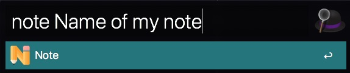

# Alfred: Notes

An [alfred](https://www.alfredapp.com/) workflow which allows you to create new markdown files suitable to use with [Notable App](https://notable.app).

## Prerequisite

First you need is to download and install the Notable app from [the official website](https://download.notable.app/?target=dmg). Then download the workflow file and install it in alfred. But you need to purchase [powerpack](https://www.alfredapp.com/powerpack/) before running this workflow. By default this workflow will create markdown files in `~/.notable/notes` folder. If you want to change it, add a variable named `notable_folder` in the workflow.

## Usage

Press `alt+space`(or the shortcut you have selected for alfred). Then type `note Name of my note`.

Then it should create new markdown file named `2020-07-13-name-of-my-note.md` inside noteable direction.

## License

MIT

## Contribution

Feel free to contribute this project. The python file used here is attached with this repository.
